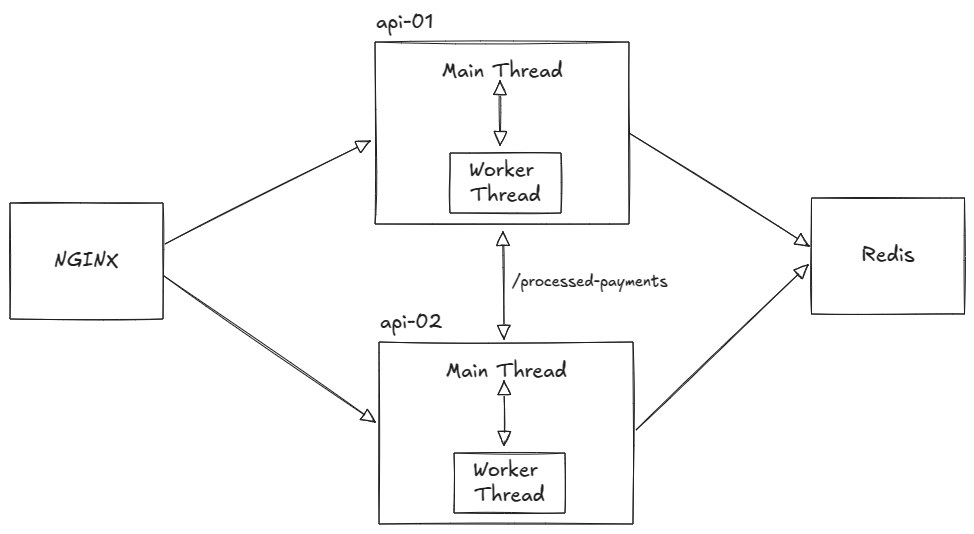

# Rinha Backend 2025 - Processador de Pagamentos

[Repositório da rinha de backend 2025](https://github.com/zanfranceschi/rinha-de-backend-2025/tree/main)

## Estrutura e Design

O projeto foi estruturado pensando em boas práticas de software aplicando conceitos de Clean Arch e alguns Design Patterns, pensando principalmente em criar um código legível, "plugável", com injeção de dependências e abstrações, no intuito de facilitar a troca de implementações e tecnologias externas entre as submissões para a rinha.

## Submissões, arquiteturas e diagrama

Fiz duas submissões principais. Em ambas a ideia geral de arquitetura é expor uma camada simples HTTP rodando na main thread que apenas recebe a requisição e repassa para um worker (worker thread), que por sua vez faz o resto do trabalho (enfileirar, processar, se conectar a serviços externos, ...), deixando a main thread livre para responder as demais requisições. Sobre a distribuição de containers, em ambas submissões temos duas instâncias da API, um NGINX atuando como Load Balancer e uma instância de Redis. Visão geral resumida:

- Camada HTTP simples na main thread;
- Worker threads lidando com fila, jobs, processamento e conexões a serviços externos;
- NGINX como Load Balancer aplicando Round-robin entre as instâncias de API
- Redis para armazenamento distribuído
- Duas instâncias da API

### Primeira submissão

Na primeira submissão quis fazer algo mais "clássico" com bibliotecas já prontas que entregavam até mais do que o necessário para fazer o sistema funcionar para o contexto da rinha. Ficou assim:

- BullMQ para gerenciamento das filas e processamento concorrente dos jobs;
- Redis (aqui foi o gargalo). Ele era usado para:
  - Gerenciamento das fila pelo BullMQ
  - Cache dos health status dos processadores default e fallback
  - Armazenamento dos pagamentos processados (para auditoria no endpoint de "payments-summary")

Muito round-trip com o Redis, o que acabou pesando um pouco e prejudicando o P99, mas honestamente, até que não achei tão ruim o resultado parcial dessa primeira submissão, que acabou lucrando líquido R$ 303.507,84 com P99 de 37.68ms.

### Segunda submissão

Depois da primeira submissão a rinha pegou preço e quis de alguma forma ganhar um bônus de P99. Precisava reduzir latência e, para isso, diminuí o uso do Redis e fiz uma fila in-memory com scheduled jobs para processar os pagamentos, simples, sem BullMQ. O armazenamento dos pagamentos processados passou a ser in-memory também, em cada instância. O Redis permaneceu apenas para cachear o health status dos processadores. Cortando a maior parte da comunicação e número de conexões com o Redis, a latência reduziu muito e aí consegui um lucro líquido de <strong>R$ 355.763,34 com P99 de 3.52ms</strong> 🔥. Sem multas (o proxy registrou todos os pagamentos, batendo 100% nas auditorias) e sem lag (o proxy processou todos os pagamentos recebidos). No momento dessa escrita, <strong>ficou no Top 3</strong> das submissões com Node.js!

- Endpoint POST "/payments":
  - Servidor HTTP recebe o pagamento e apenas repassa para o Worker thread
  - Worker recebe o pagamento e guarda para ser processado em lote, conforme intervalo de tempo configurado
  - Worker armazena in-memory os pagamentos processados com sucesso
- Endpoint GET "/payments-summary"
  - Instância que recebeu a request recupera os pagamentos processados pelo seu próprio worker através de troca de mensagem (<code>worker.postMessage</code>)
  - Recupera os pagamentos processados da outra instância através de comunicação HTTP
  - Agrega ambos, filtra pelo período e retorna
- Health Check: Uma das instâncias roda o health check a cada 5s e armazena o resultado no Redis

## Tecnologias e padrões

Falando mais especificamente das tecnologias utilizadas, todos os serviços foram implementados em Node.js com Typescript.

- Redis: Armazenamento distribuído de baixa latência.
- Undici: Cliente HTTP baixo nível do próprio Node. Foi utilizado para criar um Pool de conexões HTTP usado ao longo da execução da aplicação, diminuindo o overhead de criar uma nova conexão a cada pagamento a ser processado.
- IProcessorSelectionStrategy: abstração para a escolha do processador. A implementação que ficou foi visando pouca taxa, priorizando o default e tentando processar todos os pagamentos recebidos.
- Docker: orquestração dos containers.

## Resultados parciais das submissões

- [Resultados Submissão 1 - P99 de 37.68ms](https://github.com/zanfranceschi/rinha-de-backend-2025/blob/main/participantes/mauricio-cantu/partial-results.json)
- [Resultados Submissão 2 - P99 de 3.52ms](https://github.com/zanfranceschi/rinha-de-backend-2025/blob/main/participantes/mauricio-cantu-2/partial-results.json)

## Como rodar

`docker compose up --build` na raiz do projeto.
Projeto implementado especialmente para a rinha, então é necessário também seguir as [instruções](https://github.com/zanfranceschi/rinha-de-backend-2025/tree/main/rinha-test) da mesma.
