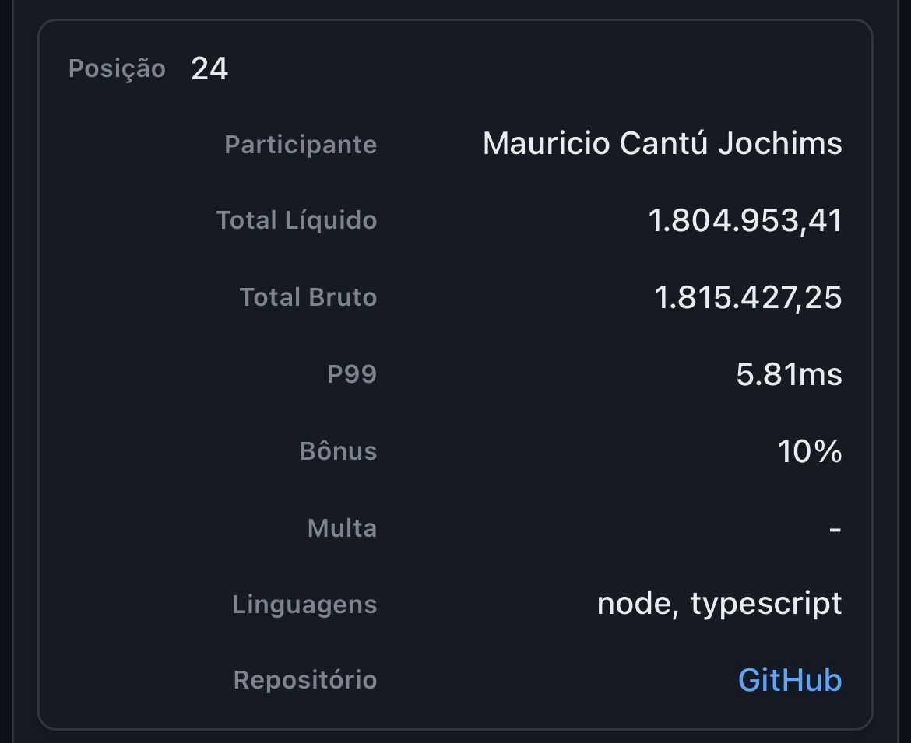

# Rinha Backend 2025 - Processador de Pagamentos

[Repositório da rinha de backend 2025](https://github.com/zanfranceschi/rinha-de-backend-2025/tree/main)

## Resultado final 🏆

- **Top 3** entre as submissões feitas com Node.js
- **Top 20** entre ~300 participantes individuais
- **Top 24** entre 400+ submissões no ranking geral

### Métricas

- P99 de **5.81ms** na métrica http_req_duration (99% das requisições responderam em até 5.81ms)
- **Bônus de 10%** pelo valor obtido no P99 abaixo de 10ms
- Lucro líquido de **R$ 1.804.953,41**
- **Sem lag** (todos os pagamentos recebidos foram processados)
- **Sem multa** (todos os pagamentos passaram com sucesso pelas auditorias do script de teste)

Link para o resultado final no repositório da Rinha: https://github.com/zanfranceschi/rinha-de-backend-2025/blob/main/participantes/mauricio-cantu/final-results.json

## Estrutura e Design

O projeto foi estruturado pensando em boas práticas de software aplicando conceitos de Clean Arch e alguns Design Patterns, pensando principalmente em criar um código legível, "plugável", com injeção de dependências e abstrações, no intuito de facilitar a troca de implementações e tecnologias externas entre as submissões para a rinha.

## Detalhes da arquitetura

- **2 instâncias HTTP leves**: rodam na main thread e repassam requisições para um worker thread
- **Load Balancer com NGINX**: Round Robin entre as instâncias
- **Worker de Healthcheck**: monitora os serviços externos a cada 5s
- **Circuit Breaker**: evita tentar processar um pagamento se os serviços externos estiverem indisponíveis
- **Redis**: cache distribuído de health status + fila de pagamentos
- **BullMQ**: gerenciamento de fila e workers para processar os pagamentos
- **Undici**: HTTP Pooling, reutiliza conexões diminuindo o overhead de criar novas a cada processamento

A tag [submission-v1](https://github.com/mauricio-cantu/rinha-backend-25/tree/submission-v1) marca o estado do repositório para a submissão que performou melhor no teste final da Rinha.

## Resultados parciais das submissões

- [Resultados Submissão 1 - P99 de 37.68ms](https://github.com/zanfranceschi/rinha-de-backend-2025/blob/main/participantes/mauricio-cantu/partial-results.json)
- [Resultados Submissão 2 - P99 de 3.52ms](https://github.com/zanfranceschi/rinha-de-backend-2025/blob/main/participantes/mauricio-cantu-2/partial-results.json)

## Como rodar

`docker compose up --build` na raiz do projeto.
Projeto implementado especialmente para a rinha, então é necessário também seguir as [instruções](https://github.com/zanfranceschi/rinha-de-backend-2025/tree/main/rinha-test) da mesma.
